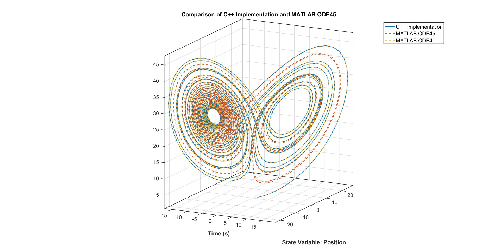

# ODE4Solver：用 C++ 實現的動態系統數值求解器



一個用於模擬動態系統的 C++ 專案，聚焦於 Lorenz 吸子與 MCK（質彈阻）系統。此專案適合學術研究與工程應用，提供模組化、可擴充的數值積分與系統模擬架構。

## 特色

- **物件導向設計**：動態系統與積分器皆以 C++ 類別模組化設計。
- **ODE4（RK4）積分法**：內建經典四階 Runge-Kutta 積分器。
- **範例系統**：內含 Lorenz 吸子與 MCK 系統模擬。
- **MATLAB 驗證**：提供 MATLAB 腳本進行結果比對。
- **Eigen3 支援**：採用 Eigen 函式庫進行高效線性代數運算。


## 快速開始

### 先備條件
- 支援 C++17 的編譯器 (測試使用 `MSVC 14.38.33130`)
- [CMake](https://cmake.org/) 版本 3.10 以上 (測試使用`3.29.9`)
- [Eigen3](https://eigen.tuxfamily.org/)（已包含於 `thirdparty/`）

### 編譯步驟

1. **下載專案**
   ```sh
   git clone https://github.com/yourusername/ode4solver.git
   cd ode4solver
   ```
2. **使用 CMake 編譯**
   ```sh
   mkdir build
   cd build
   cmake .. -G "Visual Studio 17 2022" -A x64 -T version=14.38.33130
   cmake --build . --config Debug
   ```
3. **執行範例**
   執行檔會在 `bin/Debug/`（或 `bin/Release/`）下：
   - `example_Lorenz.exe`
   - `example_MCK.exe`

### MATLAB 驗證

`matlab/` 資料夾內有驗證用腳本：
- `verify_lorenz_system.m`
- `verify_mck_system.m`

模擬結果會以 CSV 檔儲存，可與 MATLAB 輸出比對。

## 使用說明

### Lorenz 吸子範例
```sh
bin/Debug/example_Lorenz.exe
```

### MCK 系統範例
```sh
bin/Debug/example_MCK.exe
```

## 檔案說明

- `include/`  
  - `DynamicSystem.hpp`：動態系統抽象基底類別
  - `LorenzAttractor.hpp`：Lorenz 系統實作
  - `MCKSystem.hpp`：質彈阻系統實作
  - `RK4Integrator.hpp`：四階 Runge-Kutta 積分器
  - `SystemSimulator.hpp`：模擬管理器
- `src/`  
  - `example_Lorenz.cpp`：Lorenz 系統模擬範例
  - `example_MCK.cpp`：MCK 系統模擬範例
  - `CMakeLists.txt`：編譯設定
- `matlab/`  
  - MATLAB 腳本與 CSV 結果

## 如何自定義與模擬自己的 ODE 問題

本專案提供彈性架構，讓你可以輕鬆自定義自己的常微分方程（ODE）系統，並利用內建數值積分器進行模擬。以下以 Lorenz 吸子為例，說明如何擴充與使用：

### 1. 定義你的 ODE 系統

請繼承 `DynamicSystem` 抽象類別，並實作 `computeDerivatives`、`getStateDimension`、`getInputDimension` 等必要方法。例如：

```cpp
class LorenzAttractor : public DynamicSystem 
{
public:     
    LorenzAttractor(double sigma, double beta, double rho);
    Eigen::VectorXd computeDerivatives(const Eigen::VectorXd& state, const Eigen::VectorXd& input, double time) const override;
    int getStateDimension() const override { return 3; }
    int getInputDimension() const override { return 0; }
    // ... 參數存取方法 ...
};
```

`computeDerivatives` 需回傳一個與狀態維度相同的向量，描述系統的微分方程。

### 2. 建立系統與模擬器

在主程式中，先建立系統物件，再用 `SystemSimulator` 包裝：

```cpp
LorenzAttractor lorenz(10.0, 28.0, 8.0/3.0);
SystemSimulator simulator(lorenz);
```

### 3. 設定初始狀態與步進

初始化狀態向量與時間步長：

```cpp
Eigen::VectorXd initial_state(3);
initial_state << 1.0, 1.0, 1.0;
simulator.initial(initial_state, 0.01);
```

### 4. 執行模擬

以 for 迴圈進行多步積分，每步可傳入控制輸入（如無輸入可傳 0）：

```cpp
for (size_t i = 0; i < 100000; ++i)
{
    Eigen::VectorXd u(1);
    u(0) = 0.0;
    simulator.step(u);
}
```

### 5. 儲存模擬結果

模擬結束後，可將歷史資料存成 CSV 檔：

```cpp
simulator.saveHistoryToCSV("result");
```

### 6. 自定義你的 ODE 問題

只需仿照 `LorenzAttractor`，定義自己的系統類別，實作 `computeDerivatives`，即可模擬任意 ODE 問題。例如：

```cpp
class MySystem : public DynamicSystem
{
public:
    // ...建構子...
    Eigen::VectorXd computeDerivatives(const Eigen::VectorXd& state, const Eigen::VectorXd& input, double time) const override
    {
        // 實作你的微分方程
    }
    // ...其餘必要方法...
};
```

然後在主程式中建立 `MySystem` 物件並用 `SystemSimulator` 執行即可。

如需更進階功能（如多輸入、多輸出、參數調整等），可參考 `LorenzAttractor.hpp` 內的參數存取與設定方法。

## TODO
- [x] 確認狀態回饋控制功能
- [x] Step()裡面Desire的去留，目前還是保留 (先嘗試用openloop打sin波進去)
- [x] 多撈取誤差、誤差微分、誤差積分等資訊
- [x] csv新增其他欄位(誤差、誤差微分、誤差積分，甚至控制命令)
- [x] 讓其他系統問題也能使用相同的架構
- [x] 透過MATLAB驗證回授控制的正確性
- [ ] 修改README，主要是說明如何使用這個專案中的自定義ODE問題 (紀錄只要有一點點的誤差出現，就會導致高度非線性的ODE誤差(渾沌系統)會快速累積，導致後面都不一樣)
- [ ] 進行RL的整合測試

## 引用格式
若你在學術研究中使用本專案，請引用：

```
@misc{ode4solver2025,
  title={ODE4Solver},
  author={HeRong},
  year={2025},
  howpublished={\url{https://github.com/NCKU-He-Rong/ode4solver}}
}
```

## 授權

本專案採用 MIT License 授權。詳見 [LICENSE](LICENSE)。

## 致謝
- [Eigen3](https://eigen.tuxfamily.org/) 線性代數函式庫

---

如有問題或想貢獻，歡迎於 GitHub 開 issue 或 pull request。
